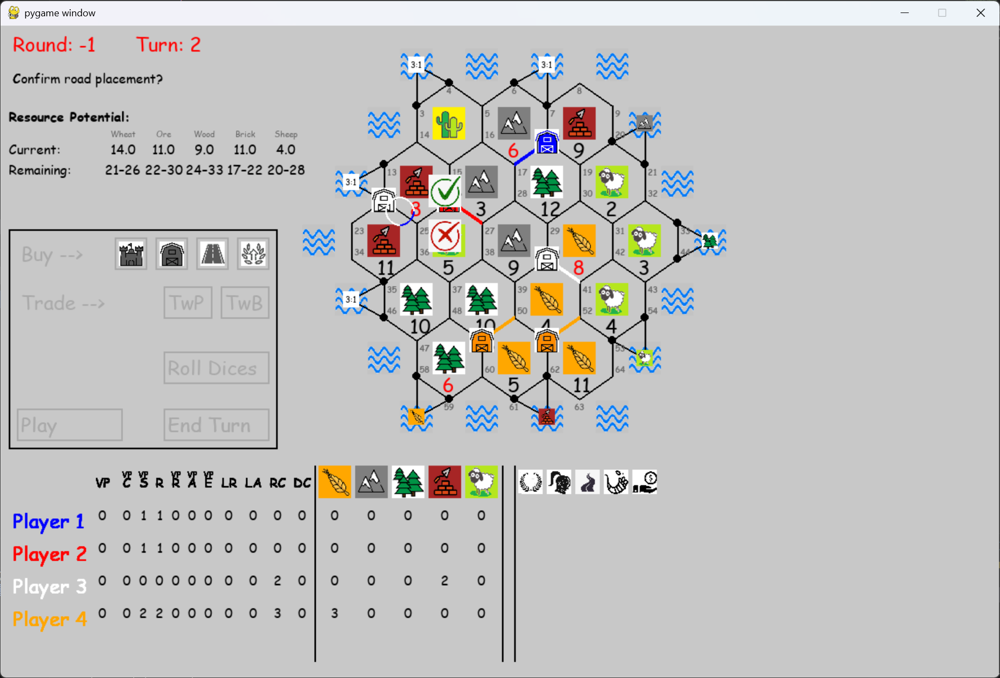

# Catan Game Project (Gen3)

Pygame implementation of the classic board game **Settlers of Catan**.

## Features

- Fully interactive **human Initial Placement** with visual guidance
- Multiple advanced AI placement algorithms
- Beautiful hexagonal board with 45 tiles (19 land + 26 sea)
- Dynamic scoreboard and action buttons
- Pulsing highlights, animations, and confirmation system
- Modular and well-documented codebase

## Placement Algorithms

The project includes several sophisticated Initial Placement strategies:

- **Max Pips** — Highest probability intersections
- **Max Pips + Ports** — Considers both resources and port access
- **5 Weighted Strategic Strategies** — Balanced, Wood/Brick, Wheat/Ore, etc.
- **Markov Chain Evaluator** — Most advanced algorithm (inspired by academic research)

**[📄 Full Technical Overview (PDF)](docs/Overview_v4.pdf)**

### Prerequisites
- Python 3.8 or higher
- Pygame

### Installation

```bash
# Clone the repository
git clone https://github.com/avtnl/Catan_Gen3__v010b.git
cd Catan_Gen3__v010b

# Recommended: Create virtual environment
python -m venv venv
source venv/bin/activate    # On Windows: venv\Scripts\activate

# Install dependencies
pip install pygame

## Getting Started
python main.py